List of models
================

-   [Summary table](#summary-table)
-   [Details](#details)
    -   [Arithmetic RW](#arithmetic-rw)
    -   [Auto ARIMA](#auto-arima)
    -   [DS-Holt](#ds-holt)
    -   [DS-Holt-damped](#ds-holt-damped)
    -   [DS-RW](#ds-rw)
    -   [DS-SES](#ds-ses)
    -   [ETS](#ets)
    -   [Geometric RW](#geometric-rw)
    -   [M4-Comp](#m4-comp)
    -   [M4-Meta](#m4-meta)
    -   [Mean](#mean)
    -   [RW](#rw)
    -   [RW-DRIFT](#rw-drift)
    -   [RW-SEAS](#rw-seas)
-   [Other models to add](#other-models-to-add)
-   [M4 competition](#m4-competition)
    -   [Misc](#misc)
    -   [Competition benchmark models](#competition-benchmark-models)
-   [Example forecasts](#example-forecasts)
    -   [What will be the daily closing price of gold on 26 April 2018 in USD?](#what-will-be-the-daily-closing-price-of-gold-on-26-april-2018-in-usd)
    -   [What will be the long-term interest rate for Portugal (PRT) in April 2018?](#what-will-be-the-long-term-interest-rate-for-portugal-prt-in-april-2018)
    -   [What will be the maximum sea ice extent on the Baffin Bay Gulf of St. Lawrence between 21 March 2018 and 10 April 2018?](#what-will-be-the-maximum-sea-ice-extent-on-the-baffin-bay-gulf-of-st.-lawrence-between-21-march-2018-and-10-april-2018)

Summary table
-------------

<table>
<colgroup>
<col width="53%" />
<col width="10%" />
<col width="14%" />
<col width="21%" />
</colgroup>
<thead>
<tr class="header">
<th align="left">Short name / Name</th>
<th align="center"><span class="math inline"><em>λ</em></span> heuristic</th>
<th align="left">Model Function</th>
<th align="left">Basis Function</th>
</tr>
</thead>
<tbody>
<tr class="odd">
<td align="left"><strong>Arithmetic RW</strong> <br /> Random walk on raw scale</td>
<td align="center"></td>
<td align="left"><code>arithmetic_rw_forecast</code></td>
<td align="left"><code>forecast::Arima(c(0,1,0), lambda = NULL)</code></td>
</tr>
<tr class="even">
<td align="left"><strong>Auto ARIMA</strong> <br /> Seasonal ARIMA model with automatic selection of the ARIMA model form</td>
<td align="center">X</td>
<td align="left"><code>auto_arima_forecast</code></td>
<td align="left"><code>forecast::auto.arima()</code></td>
</tr>
<tr class="odd">
<td align="left"><strong>DS-Holt</strong> <br /> De-seasoned Holt's linear trend method / ETS(A,A,N)</td>
<td align="center"></td>
<td align="left"><code>holt_deseasoned_forecast</code></td>
<td align="left"><code>ets(des_ts, 'AAN')</code></td>
</tr>
<tr class="even">
<td align="left"><strong>DS-Holt-damped</strong> <br /> De-seasoned Holt's linear trend method with damped trend / ETS(A,Ad,N)</td>
<td align="center"></td>
<td align="left"><code>damped_deseasoned_forecast</code></td>
<td align="left"><code>ets(des_ts, 'AAN', damped=TRUE)</code></td>
</tr>
<tr class="odd">
<td align="left"><strong>DS-RW</strong> <br /> De-seasoned random walk</td>
<td align="center"></td>
<td align="left"><code>rw_deseasoned_forecast</code></td>
<td align="left"><code>forecast::rwf(ds_ts)</code></td>
</tr>
<tr class="even">
<td align="left"><strong>DS-SES</strong> <br /> De-seasoned simple exponential smoothing / ETS(A,N,N)</td>
<td align="center"></td>
<td align="left"><code>ses_deseasoned_forecast</code></td>
<td align="left"><code>ets(des_ts, 'ANN')</code></td>
</tr>
<tr class="odd">
<td align="left"><strong>ETS</strong> <br /> Exponential smoothing state space model</td>
<td align="center">?</td>
<td align="left"><code>ets_forecast</code></td>
<td align="left"><code>forecast::ets()</code></td>
</tr>
<tr class="even">
<td align="left"><strong>Geometric RW</strong> <br /> Random walk on log scale</td>
<td align="center"></td>
<td align="left"><code>geometric_rw_forecast</code></td>
<td align="left"><code>forecast::Arima(c(0,1,0), lambda = 0)</code></td>
</tr>
<tr class="odd">
<td align="left"><strong>M4-Comp</strong> <br /> M4 Composite benchmark, average of de-seasoned SES, linear trend, and damped trend smoothing</td>
<td align="center"></td>
<td align="left"><code>m4comb_forecast</code></td>
<td align="left"><code>Custom / None</code></td>
</tr>
<tr class="even">
<td align="left"><strong>M4-Meta</strong> <br /> M4 Meta ensemble model</td>
<td align="center"></td>
<td align="left"><code>m4meta_forecast</code></td>
<td align="left"><code>M4metalearning::forecast_meta_m4</code></td>
</tr>
<tr class="odd">
<td align="left"><strong>Mean</strong> <br /> Constant mean model / ARIMA(0,0,0)</td>
<td align="center">X</td>
<td align="left"><code>constant_mean_forecast</code></td>
<td align="left"><code>forecast::Arima(c(0,0,0))</code></td>
</tr>
<tr class="even">
<td align="left"><strong>RW</strong> <br /> Random walk / ARIMA(0,1,0)</td>
<td align="center">X</td>
<td align="left"><code>rw_forecast</code></td>
<td align="left"><code>forecast::rwf()</code></td>
</tr>
<tr class="odd">
<td align="left"><strong>RW-DRIFT</strong> <br /> Random walk with drift</td>
<td align="center">X</td>
<td align="left"><code>rw_drift_forecast</code></td>
<td align="left"><code>forecast::rwf(drift = TRUE)</code></td>
</tr>
<tr class="even">
<td align="left"><strong>RW-SEAS</strong> <br /> Seasonal random walk</td>
<td align="center">X</td>
<td align="left"><code>rw_seasonal_forecast</code></td>
<td align="left"><code>forecast::snaive()</code></td>
</tr>
</tbody>
</table>

Details
-------

### Arithmetic RW

Random walk on raw scale

Implemented with `forecast::Arima(c(0,1,0), lambda = NULL)`

Arithmetic random walk, i.e. on the raw, untransformed time series. Point predictions always equal the last observed data point.

### Auto ARIMA

Seasonal ARIMA model with automatic selection of the ARIMA model form

Implemented with `forecast::auto.arima()`

This chooses and estimates a ARIMA(*p*, *d*, *q*)(*P*, *D*, *Q*)<sub>*m*</sub> model, where *p*, *d*, *q* are the regular ARIMA parameters, *P*, *D*, *Q* are seasonal terms for frequency *m* time series data. See [Hyndman and Athanasopoulos, 2018, 8.7](https://otexts.org/fpp2/arima-r.html) and [8.9](https://otexts.org/fpp2/seasonal-arima.html).

### DS-Holt

De-seasoned Holt's linear trend method / ETS(A,A,N)

Implemented with `ets(des_ts, 'AAN')`

Holt's linear trend method / exponential smoothing with linear trend / ETS(A,A,N) model on de-seasoned data. The seasonal components are re-added to the model forecast. M4-f5 benchmark model

### DS-Holt-damped

De-seasoned Holt's linear trend method with damped trend / ETS(A,Ad,N)

Implemented with `ets(des_ts, 'AAN', damped=TRUE)`

Holt's linear trend method with damped trend / exponential smoothing with damped linear trend / ETS(A,Ad,N) model on de-seasoned data. The seasonal components are re-added to the model forecast. M4-f6 benchmark model

### DS-RW

De-seasoned random walk

Implemented with `forecast::rwf(ds_ts)`

This is a random walk on de-seasoned data, with any seasonal components re-added to the RW forecast. M4-f3 benchmark model.

### DS-SES

De-seasoned simple exponential smoothing / ETS(A,N,N)

Implemented with `ets(des_ts, 'ANN')`

Simple exponential smooting / ETS(A,N,N) model on de-seasoned data. The seasonal components are re-added to the model forecast. M4-f4 benchmark model

### ETS

Exponential smoothing state space model

Implemented with `forecast::ets()`

A exponential smoothing state space model of the form ETS(error, trend, season, damped), where the error, trend, and season components can be additive, multiplicative, or null, and where optionally a damped trend can be used. All components are automatically chosen using AIC. This model subsumes simpler classical smoothing methods like Holt and Holt-Winters filtering. See [Hyndman and Athanasopoulos, 2018, 7.5](https://otexts.org/fpp2/ets.html) for a summary.

### Geometric RW

Random walk on log scale

Implemented with `forecast::Arima(c(0,1,0), lambda = 0)`

A geometric random walk, i.e. on the log transformed input time series, and thus more appropriate for series with exponential growth. All values in the input time series must be &gt; 0.

### M4-Comp

M4 Composite benchmark, average of de-seasoned SES, linear trend, and damped trend smoothing

Implemented with `Custom / None`

The M4 benchmark composite model is a simple average of forecasts from three models, all with the de-seasoned data correction: simple exponential smoothing (ETS(A,N,N)), Holt's linear trend method (ETS(A,A,N)), and exponential smoothing with a damped trend (ETS(A,Ad,N)).

The de-seasoning works by testing data for strong enough seasonality, and in such cases, the seasonal component is removed through classical time series decomposition before models are estimated, and then re-added to the resulting forecasts.

### M4-Meta

M4 Meta ensemble model

Implemented with `M4metalearning::forecast_meta_m4`

An ensemble model from the M4 competition. The forecast is based on a linear combination of forecasts from 9 time series models, where the weights are calculated by a xgboost model using characteristics of the input time series as features. Essentially the meta model learns to weigh time series models that work well for a given series more. The models for the mean forecast are Auto ARIMA, ETS, NNETAR, TBATS, STLM-AR, RW-DRIFT, THETAF, RW (NAIVE) and RW-SEAS. The 95% prediction interval is computed only from 3 models, THETAF and the RW models. A total of 42 input series characteristics are used to fit the meta-model.

For more details, see the note at <http://htmlpreview.github.io/?https://github.com/robjhyndman/M4metalearning/blob/master/docs/M4_methodology.html>

### Mean

Constant mean model / ARIMA(0,0,0)

Implemented with `forecast::Arima(c(0,0,0))`

This model always predicts the mean of the input time series, and the prediction interval is similarly estimated using the input time series variance, although with a standard uncertainty correction for the number of observations.

### RW

Random walk / ARIMA(0,1,0)

Implemented with `forecast::rwf()`

Simple random walk, equivalent to a ARIMA(0,1,0) model, with *Y*<sub>*t*</sub> = *Y*<sub>*t* − 1</sub> + *Z*<sub>*t*</sub>, where *Z*<sub>*t*</sub> is normal iid error.

### RW-DRIFT

Random walk with drift

Implemented with `forecast::rwf(drift = TRUE)`

A random walk with drift, i.e. *Y*<sub>*t*</sub> = *c* + *Y*<sub>*t* − 1</sub> + *Z*<sub>*t*</sub>, where *c* is the drift.

### RW-SEAS

Seasonal random walk

Implemented with `forecast::snaive()`

Seasonal random walk with *Y*<sub>*t*</sub> = *Y*<sub>*t* − *m*</sub> + *Z*<sub>*t*</sub>, where *m* is the seasonal frequency.

Other models to add
-------------------

-   NNAR: neural net with autoregressive terms
-   TBATS
-   STLM-AR
-   THETAF
-   M4-Meta: 2nd place in M4
-   Hybrid-RNN: 1st place, but needs to be ported

M4 competition
--------------

The benchmark and second place winner in the M4 competition were ensemble models that would not be too hard to integrate. And the benchmark is very simple, would not be difficult at all.

Competition benchmark: raw code at <https://github.com/M4Competition/M4-methods/blob/master/Benchmarks%20and%20Evaluation.R>, it is a combination f4, 5, and 6, which are plain exponential smoothing models on deseasoned data.

Hyndman et all have a M4 meta learning model, basically 9 plain time series models whose ensemble weights are determined by xgboost using a broad range of extra time series features extracted as features for the meta model. See here <https://github.com/robjhyndman/M4metalearning/blob/master/R/forec_methods_list.R> and here <https://github.com/M4Competition/M4-methods/blob/master/245%20-%20pmontman/M4-Method-Description.pdf>.

The 3 and 9 component models for the benchmark and M4\_meta model are already included in the list above.

The ES-RNN model is described here <https://eng.uber.com/m4-forecasting-competition/>. For code and more description see <https://github.com/M4Competition/M4-methods/tree/master/118%20-%20slaweks17> and <https://github.com/M4Competition/M4-methods/tree/slaweks_ES-RNN>.

### Misc

CRPS: <https://www.met-learning.eu/pluginfile.php/5277/mod_resource/content/6/www/english/msg/ver_prob_forec/uos3b/uos3b_ko1.htm>

-   <https://robjhyndman.com/hyndsight/gefcom2014/>

### Competition benchmark models

``` r
SeasonalityTest <- function(input, ppy){
  #Used to determine whether a time series is seasonal
  tcrit <- 1.645
  if (length(input)<3*ppy){
    test_seasonal <- FALSE
  }else{
    xacf <- acf(input, plot = FALSE)$acf[-1, 1, 1]
    clim <- tcrit/sqrt(length(input)) * sqrt(cumsum(c(1, 2 * xacf^2)))
    test_seasonal <- ( abs(xacf[ppy]) > clim[ppy] )
    
    if (is.na(test_seasonal)==TRUE){ test_seasonal <- FALSE }
  }
  
  return(test_seasonal)
}

Benchmarks <- function(input, fh){
  #Used to estimate the statistical benchmarks of the M4 competition
  
  #Estimate seasonaly adjusted time series
  ppy <- frequency(input) ; ST <- F
  if (ppy>1){ ST <- SeasonalityTest(input,ppy) }
  if (ST==T){
    Dec <- decompose(input,type="multiplicative")
    des_input <- input/Dec$seasonal
    SIout <- head(rep(Dec$seasonal[(length(Dec$seasonal)-ppy+1):length(Dec$seasonal)], fh), fh)
  }else{
    des_input <- input ; SIout <- rep(1, fh)
  }
  
  f1 <- naive(input, h=fh)$mean #Naive
  f2 <- naive_seasonal(input, fh=fh) #Seasonal Naive
  f3 <- naive(des_input, h=fh)$mean*SIout #Naive2
  f4 <- ses(des_input, h=fh)$mean*SIout #Ses
  f5 <- holt(des_input, h=fh, damped=F)$mean*SIout #Holt
  f6 <- holt(des_input, h=fh, damped=T)$mean*SIout #Damped
  f7 <- Theta.classic(input=des_input, fh=fh)$mean*SIout #Theta
  f8 <- (f4+f5+f6)/3 #Comb
  
  return(list(f1,f2,f3,f4,f5,f6,f7,f8))
}
```

Example forecasts
-----------------

### What will be the daily closing price of gold on 26 April 2018 in USD?


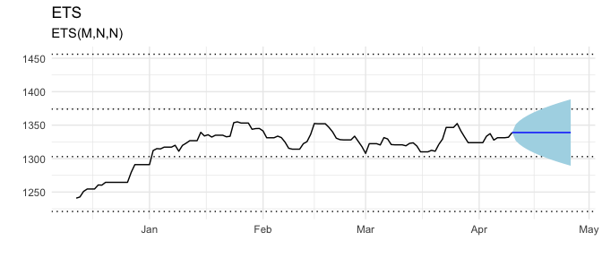


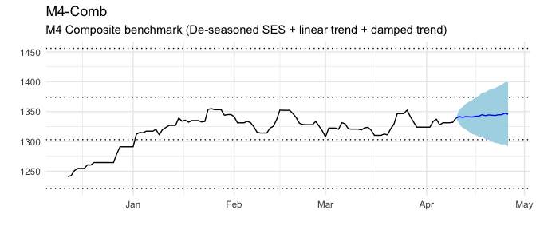


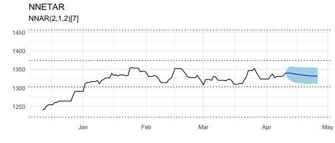

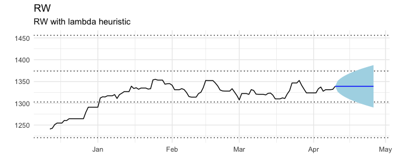

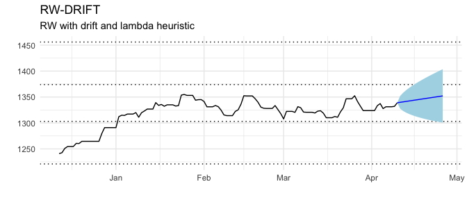

### What will be the long-term interest rate for Portugal (PRT) in April 2018?


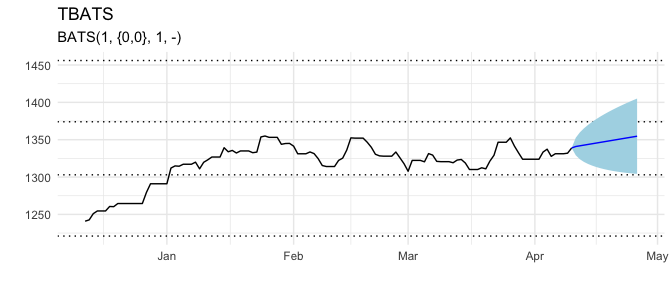

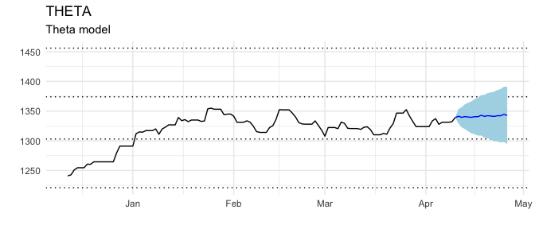


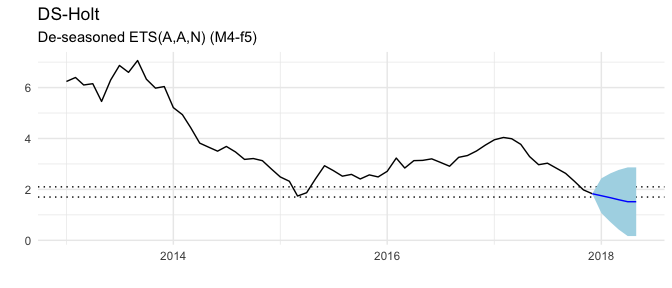


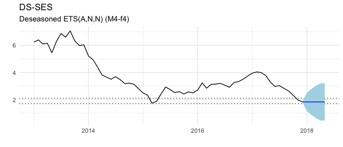

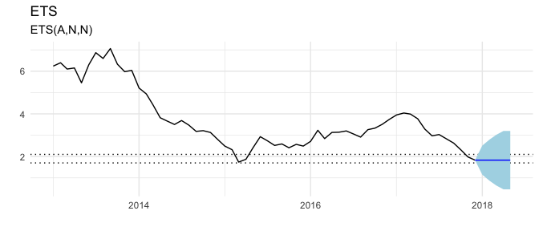

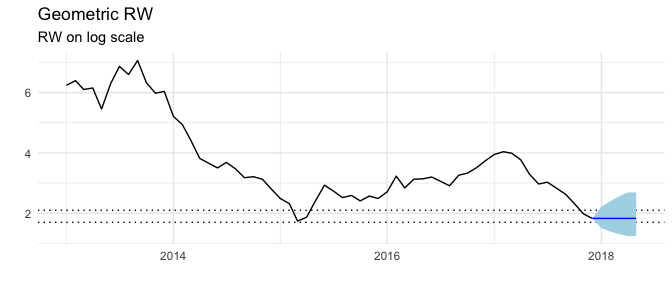


### What will be the maximum sea ice extent on the Baffin Bay Gulf of St. Lawrence between 21 March 2018 and 10 April 2018?

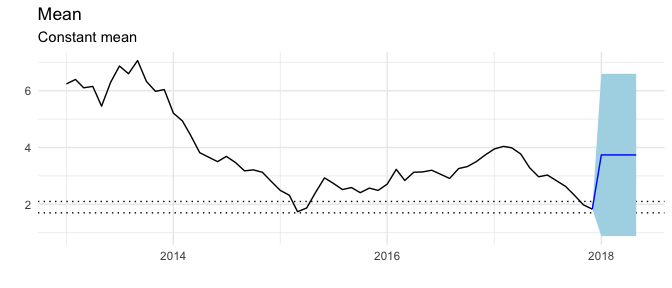


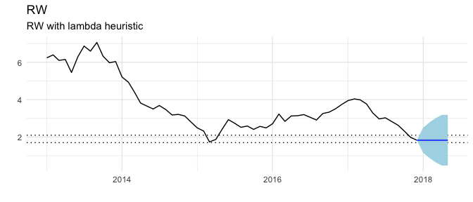


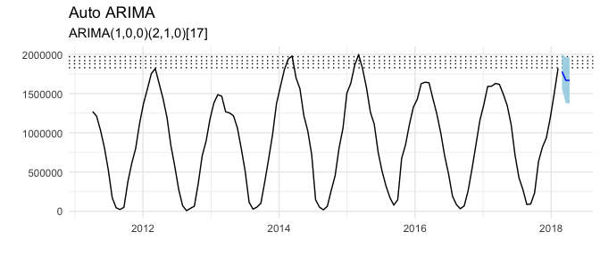


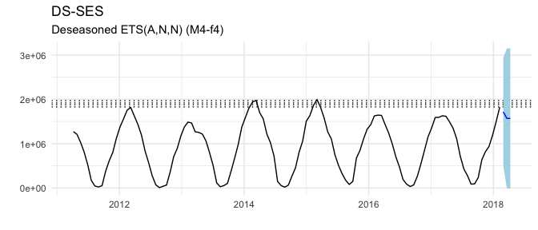
