RCT test output
================
2018-06-26

-   [Open IFP summary table](#open-ifp-summary-table)
-   [Open IFP plots](#open-ifp-plots)
-   [Closed IFP summary table](#closed-ifp-summary-table)
-   [Closed IFP plots](#closed-ifp-plots)

Open IFP summary table
======================

|   IFP|    N|    h| lambda | time  | data\_type | data\_agg | partial\_train | partial\_y | end        |
|-----:|----:|----:|:-------|:------|:-----------|:----------|:---------------|:-----------|:-----------|
|   893|  120|   21|        | day   | continuous | no        |                | no         | 2018-06-29 |
|  2000|   60|    1| 0      | month | count      | yes       | used           | no         | 2018-06-30 |
|  1964|   60|    1|        | month | count      | yes       | used           | no         | 2018-06-30 |
|  1721|   60|    3|        | month | continuous | no        |                | no         | 2018-06-30 |
|  1433|   60|    1|        | month | continuous | no        |                | no         | 2018-06-30 |
|  1226|   60|    1|        | month | count      | yes       |                | yes        | 2018-06-30 |
|  1217|   60|    2|        | month | continuous | no        |                | no         | 2018-06-30 |
|   875|   60|    2|        | month | continuous | no        |                | no         | 2018-06-30 |
|  2135|   60|    2|        | month | continuous | no        |                | no         | 2018-07-31 |
|  2126|   41|    2|        | month | count      | yes       | used           | no         | 2018-07-31 |
|  2072|   60|    2|        | month | count      | yes       | discarded      | no         | 2018-07-31 |
|  1973|   60|    4|        | month | continuous | no        |                | no         | 2018-07-31 |
|  1829|   60|    4|        | month | count      | no        |                | no         | 2018-07-31 |
|  1793|   60|    2|        | month | continuous | no        |                | no         | 2018-07-31 |
|  1730|   60|    2|        | month | continuous | no        |                | no         | 2018-07-31 |
|  1622|   41|    2|        | month | count      | yes       | discarded      | no         | 2018-07-31 |
|  1451|   60|    4|        | month | count      | no        |                | no         | 2018-07-31 |
|  1190|   60|    2| 0      | month | count      | yes       | used           | no         | 2018-07-31 |
|  1136|   60|    3| 0.5    | month | count      | yes       | discarded      | no         | 2018-07-31 |
|  1271|   19|    2|        | fixed | count      | yes       | used           | no         | 2018-08-22 |
|  2117|   60|    3| 0.5    | month | count      | yes       | no             | no         | 2018-08-31 |

Open IFP plots
==============

Request 893
-----------

What will be the South Korean Won to one U.S. Dollar daily exchange rate on 29 June 2018?

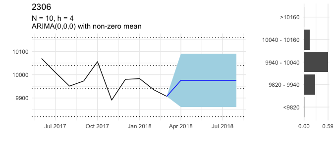

Request 2000
------------

How many deaths perpetrated by Boko Haram will the Council on Foreign Relations report for June 2018?

Request 1964
------------

Will ACLED record any riot/protest events in Cameroon in June 2018?

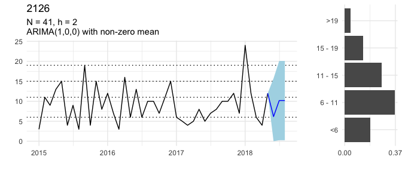

Request 1721
------------

What will be the long-term interest rate for Russia (RUS) in June 2018?

Request 1433
------------

What will be the short-term interest rate for the Czech Republic (CZE) in June 2018?

Request 1226
------------

Will ACLED record any civilian fatalities in Ghana in June 2018?

Request 1217
------------

What will be the approval rate for Japan's cabinet in NHK's monthly survey in June 2018?

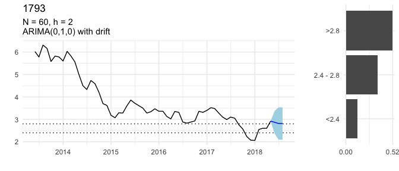

Request 875
-----------

What will be the FAO Sugar Price Index in June 2018?

Request 2135
------------

What will be the long-term interest rate for South Africa (ZAF) in July 2018?

Request 2126
------------

How many earthquakes of magnitude 6 or stronger will occur worldwide in July 2018?

Request 2072
------------

How many 'hacking or malware (HACK)' data breaches will Privacy Rights Clearinghouse record in July 2018?

Request 1973
------------

What will be the short-term interest rate for Indonesia (IDN) in July 2018?

Request 1829
------------

How much crude oil will Venezuela produce in July 2018?

Request 1793
------------

What will be the long-term interest rate for Hungary (HUN) in July 2018?

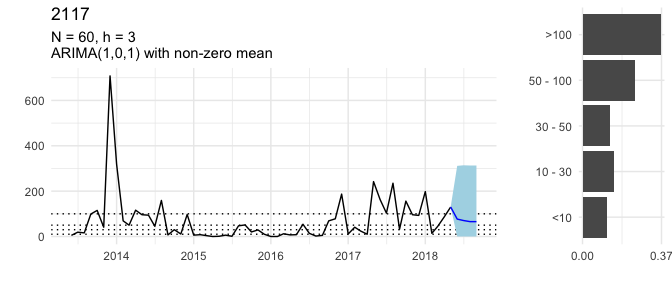

Request 1730
------------

What will be the short-term interest rate for Canada (CAN) in July 2018?

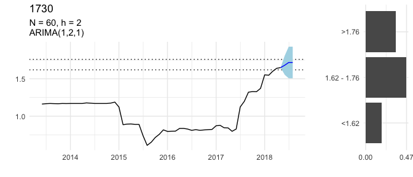

Request 1622
------------

Will ACLED record any civilian fatalities in Sri Lanka in July 2018?

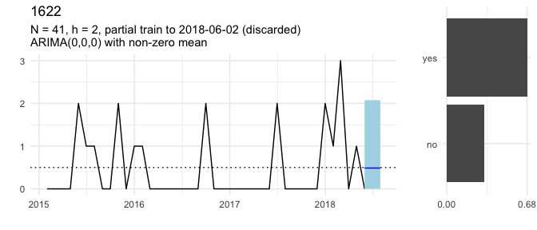

Request 1451
------------

How much crude oil will Nigeria produce in July 2018?

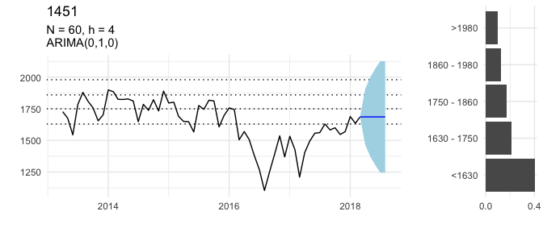

Request 1190
------------

How many deaths perpetrated by Boko Haram will the Council on Foreign Relations report for July 2018?

Request 1136
------------

Will ACLED record any riot/protest events in Gambia in July 2018?

Request 1271
------------

How many United Nations Security Council Resolutions concerning Syria will be vetoed by Russia between 22 April 2018 and 22 August 2018?

Request 2117
------------

How many battle deaths will ACLED record in Central African Republic in August 2018?

Closed IFP summary table
========================

|   IFP|    N|    h| lambda | time  | data\_type | data\_agg | partial\_train | partial\_y | end        |
|-----:|----:|----:|:-------|:------|:-----------|:----------|:---------------|:-----------|:-----------|
|  1892|   60|    2|        | month | count      | no        |                | no         | 2018-05-31 |
|  1712|  120|    1|        | day   | continuous | no        |                | no         | 2018-06-05 |
|  1694|   60|    1|        | month | count      | yes       | no             | no         | 2018-05-31 |
|  1541|  120|   45|        | day   | continuous | no        |                | no         | 2018-05-31 |
|  1514|   40|    1|        | month | count      | yes       | no             | no         | 2018-05-31 |
|  1406|   60|    2|        | month | continuous | no        |                | no         | 2018-05-31 |
|  1244|    5|    1|        | month | continuous | no        |                | no         | 2018-04-30 |
|  1235|   60|    1|        | month | continuous | no        |                | no         | 2018-04-30 |
|  1208|  120|    1|        | fixed | continuous | yes       |                | yes        | 2018-04-10 |
|  1172|   60|    1|        | month | count      | yes       | no             | no         | 2018-04-30 |
|  1145|   60|    2|        | month | continuous | no        |                | no         | 2018-04-30 |
|  1055|  120|    1|        | fixed | count      | yes       |                | yes        | 2018-04-10 |
|  1037|   60|    1|        | month | continuous | no        |                | no         | 2018-04-30 |
|  1028|  120|    2|        | day   | continuous | no        |                | no         | 2018-04-26 |
|  1019|   60|    1|        | month | continuous | no        |                | no         | 2018-05-31 |
|   938|   44|    1|        | fixed | count      | yes       |                | yes        | 2018-04-10 |
|   929|   60|    2|        | month | count      | no        |                | no         | 2018-05-31 |
|   920|   60|    1|        | month | continuous | no        |                | no         | 2018-03-31 |
|   911|   60|    2| 0.5    | month | count      | yes       | discarded      | no         | 2018-03-31 |
|   902|   60|    3|        | month | count      | yes       | discarded      | no         | 2018-04-30 |
|   884|  120|   10|        | fixed | count      | no        |                | no         | 2018-03-18 |
|   866|   38|    1|        | month | count      | yes       |                | yes        | 2018-03-31 |
|   839|   60|    1| 0.5    | month | count      | yes       | no             | no         | 2018-04-30 |
|   830|   16|    1|        | month | count      | yes       | no             | no         | 2018-05-31 |
|   821|   15|    1|        | month | count      | yes       | no             | no         | 2018-04-30 |

Closed IFP plots
================

Request 884
-----------

How many positive influenza virus detections will FluNet record for China between 12 March 2018 and 18 March 2018 (epidemiological week 11)?

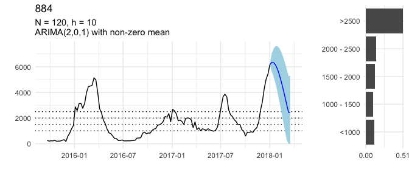

Request 920
-----------

What will be the long-term interest rate for Greece (GRC) in March 2018?

Request 911
-----------

How many material conflict events involving Occupied Palestinian Territory will ICEWS record in March 2018?

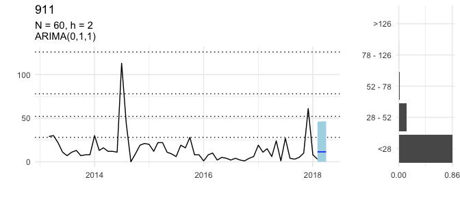

Request 866
-----------

How many earthquakes of magnitude 5 or stronger will occur worldwide in March 2018?

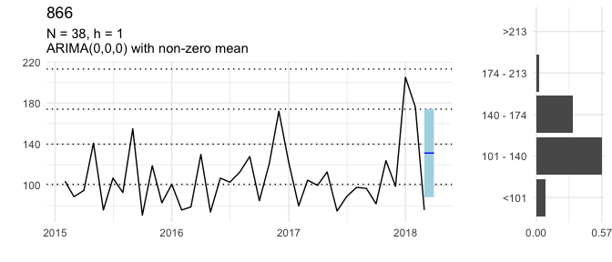

Request 1208
------------

What will be the maximum sea ice extent on the Baffin Bay Gulf of St. Lawrence between 21 March 2018 and 10 April 2018?

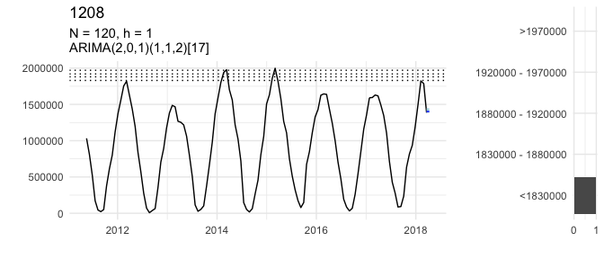

Request 1055
------------

What will be the maximum sea ice extent on the Bering Sea between 14 March 2018 and 10 April 2018?

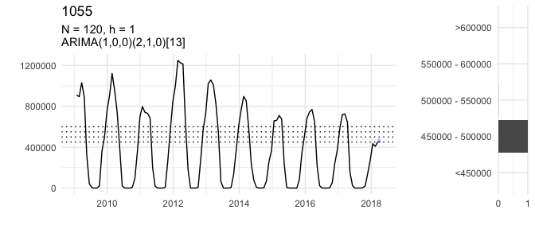

Request 938
-----------

What will be the maximum sea ice extent on the Barents Sea between 1 January 2018 and 10 April 2018?

Request 1028
------------

What will be the daily closing price of gold on 26 April 2018 in USD?

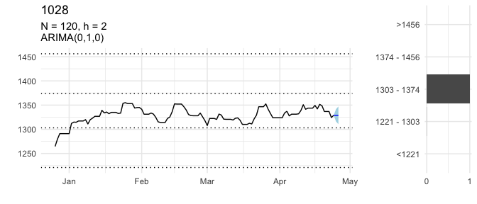

Request 1244
------------

What will be the monthly period-over-period change in the consumer price index (CPI) for Niger in April 2018?

Request 1235
------------

What will be the monthly period-over-period change in the consumer price index (CPI) for Benin in April 2018?

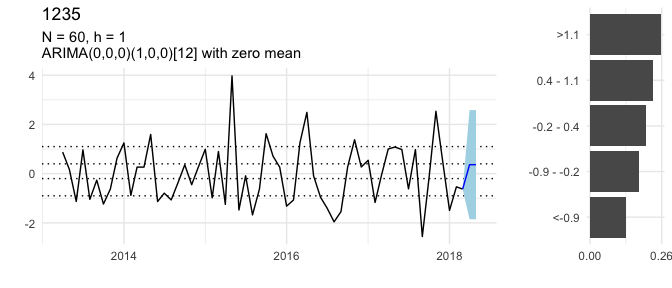

Request 1172
------------

How many 'hacking or malware (HACK)' data breaches will Privacy Rights Clearinghouse record in April 2018?

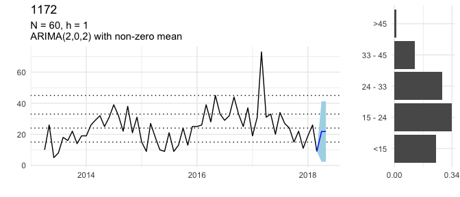

Request 1145
------------

What will be the monthly Period-over-Period change in the consumer price index (CPI) for Malawi in April (Month 04) 2018?

Request 1037
------------

What will be the long-term interest rate for Portugal (PRT) in April 2018?

Request 902
-----------

How many material conflict events involving India will ICEWS record in April 2018?

Request 839
-----------

Will ACLED record any riot/protest events in Gabon in April 2018?

Request 821
-----------

How many battle deaths will ACLED record in Afghanistan in April 2018?

Request 1892
------------

How much crude oil will Iraq produce in May 2018?

Request 1694
------------

How many 'hacking or malware (HACK)' data breaches will Privacy Rights Clearinghouse record in May 2018?

Request 1541
------------

What will be the daily closing spot price of Brent crude oil (USD per barrel) on 31 May 2018, according to the U.S. EIA?

Request 1514
------------

How many earthquakes of magnitude 5 or stronger will occur worldwide in May 2018?

Request 1406
------------

What will be the monthly period-over-period change in the consumer price index (CPI) for Egypt in May 2018?

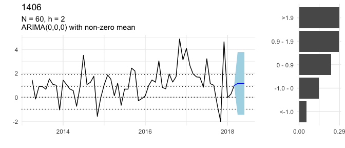

Request 1019
------------

What will be the FAO Dairy Price Index in May 2018?

Request 929
-----------

How much crude oil will Libya produce in May 2018?

Request 830
-----------

How many battle deaths will ACLED record in Yemen in May 2018?

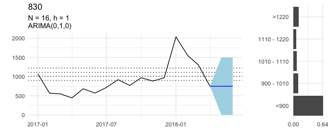

Request 1712
------------

What will be the daily closing price of gold on 5 June 2018 in USD?

