RCT test output
================
2018-05-31

-   [Are the base models estimating and without obvious mistakes?](#are-the-base-models-estimating-and-without-obvious-mistakes)
-   [Plot ARIMA forecasts for open IFPs](#plot-arima-forecasts-for-open-ifps)
-   [Plots for closed IFPs](#plots-for-closed-ifps)

Are the base models estimating and without obvious mistakes?
============================================================

|   IFP| time  | data\_type |    N|    h|  lambda| data\_agg | partial\_train | partial\_y |
|-----:|:------|:-----------|----:|----:|-------:|:----------|:---------------|:-----------|
|  2099| NA    | NA         |   NA|   NA|      NA| NA        | NA             | NA         |
|  2072| month | count      |   60|    3|      NA| no        | discarded      | no         |
|  1694| NA    | NA         |   NA|   NA|      NA| NA        | NA             | NA         |
|  1622| month | count      |   38|    5|      NA| no        | used           | no         |
|  1541| day   | continuous |  120|   45|      NA| no        | no             | no         |
|  1514| month | count      |   40|    1|      NA| no        | no             | yes        |
|  1451| month | count      |   60|    5|      NA| no        | used           | no         |
|  1433| month | continuous |   60|    4|      NA| no        | used           | no         |
|  1406| month | continuous |   60|    3|      NA| no        | used           | no         |
|  1271| fixed | count      |   19|    2|      NA| yes       | used           | no         |
|  1235| month | continuous |   60|    2|      NA| no        | used           | no         |
|  1226| month | count      |   60|    5|      NA| no        | discarded      | no         |
|  1217| month | continuous |   60|    4|      NA| no        | discarded      | no         |
|  1208| fixed | continuous |  120|    1|      NA| yes       | no             | yes        |
|  1190| month | count      |   60|    4|     0.5| no        | discarded      | no         |
|  1172| month | count      |   60|    2|      NA| no        | discarded      | no         |
|  1145| month | continuous |   60|    2|      NA| no        | used           | no         |
|  1136| month | count      |   60|    7|     0.5| no        | discarded      | no         |
|  1055| fixed | continuous |  120|    1|      NA| yes       | no             | yes        |
|  1037| month | continuous |   60|    1|      NA| no        | used           | no         |
|  1028| day   | continuous |  120|   14|      NA| no        | no             | no         |
|  1019| month | continuous |   60|    3|      NA| no        | discarded      | no         |
|   938| NA    | NA         |   NA|   NA|      NA| NA        | NA             | NA         |
|   929| month | count      |   60|    3|      NA| no        | used           | no         |
|   911| month | count      |   60|    3|     0.5| no        | discarded      | no         |
|   902| month | count      |   60|    3|      NA| no        | discarded      | no         |
|   893| day   | continuous |  120|   85|      NA| no        | no             | no         |
|   884| fixed | count      |  120|   11|      NA| no        | discarded      | no         |
|   875| month | continuous |   60|    4|      NA| no        | discarded      | no         |
|   866| month | count      |   38|    1|      NA| no        | no             | yes        |
|   839| month | count      |   60|    3|     0.0| no        | discarded      | no         |
|   830| month | count      |   16|    1|      NA| no        | used           | no         |
|   821| month | count      |   14|    2|      NA| no        | used           | no         |

| IFP  | Error                                                                                                                          |
|:-----|:-------------------------------------------------------------------------------------------------------------------------------|
| 938  | r\_basil\_ts(): Send daily data in the request, not aggregated data. Question is over 100 day                                  |
| 2099 | validate\_data(target, pr*d**a**t**a**p**e**r**i**o**d*, *p**r*question\_period, pr$ifp\_name): Request data appear |
| 1694 | validate\_seps(request*p**a**y**l**o**a**d*separations$values): Separations appear to be mis-parsed, mul                       |

Plot ARIMA forecasts for open IFPs
==================================

Request 2099
------------

What will be the daily closing price of Swiss Market Index (INDEXSWX: SMI) on 28 June 2018?

Request 2072
------------

How many 'hacking or malware (HACK)' data breaches will Privacy Rights Clearinghouse record in July 2018?

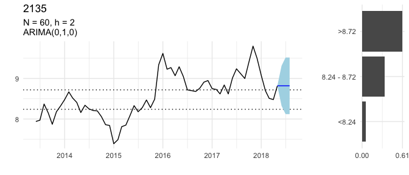

Request 1694
------------

How many 'hacking or malware (HACK)' data breaches will Privacy Rights Clearinghouse record in May 2018?

Request 1622
------------

Will ACLED record any civilian fatalities in Sri Lanka in July 2018?

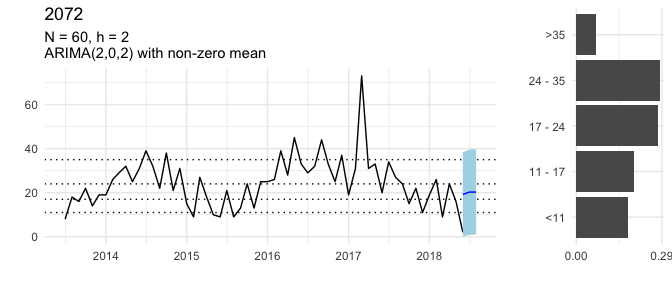

Request 1451
------------

How much crude oil will Nigeria produce in July 2018?

Request 1433
------------

What will be the short-term interest rate for the Czech Republic (CZE) in June 2018?

Request 1271
------------

How many United Nations Security Council Resolutions concerning Syria will be vetoed by Russia between 22 April 2018 and 22 August 2018?

Request 1226
------------

Will ACLED record any civilian fatalities in Ghana in June 2018?

Request 1217
------------

What will be the approval rate for Japan's cabinet in NHK's monthly survey in June 2018?

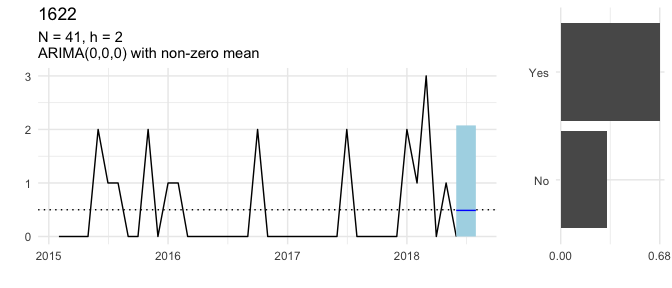

Request 1190
------------

How many deaths perpetrated by Boko Haram will the Council on Foreign Relations report for July 2018?

Request 1136
------------

Will ACLED record any riot/protest events in Gambia in July 2018?

Request 893
-----------

What will be the South Korean Won to one U.S. Dollar daily exchange rate on 29 June 2018?

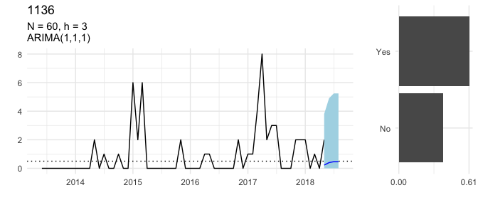

Request 875
-----------

What will be the FAO Sugar Price Index in June 2018?

Plots for closed IFPs
=====================

Request 1541
------------

What will be the daily closing spot price of Brent crude oil (USD per barrel) on 31 May 2018, according to the U.S. EIA?

Request 1514
------------

How many earthquakes of magnitude 5 or stronger will occur worldwide in May 2018?

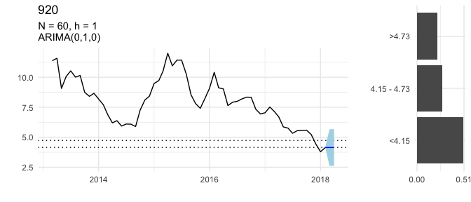

Request 1406
------------

What will be the monthly period-over-period change in the consumer price index (CPI) for Egypt in May 2018?

Request 1235
------------

What will be the monthly period-over-period change in the consumer price index (CPI) for Benin in April 2018?

Request 1208
------------

What will be the maximum sea ice extent on the Baffin Bay Gulf of St. Lawrence between 21 March 2018 and 10 April 2018?

Request 1172
------------

How many 'hacking or malware (HACK)' data breaches will Privacy Rights Clearinghouse record in April 2018?

Request 1145
------------

What will be the monthly Period-over-Period change in the consumer price index (CPI) for Malawi in April (Month 04) 2018?

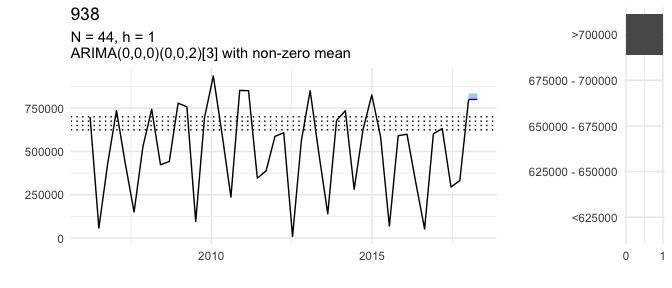

Request 1055
------------

What will be the maximum sea ice extent on the Bering Sea between 14 March 2018 and 10 April 2018?

Request 1037
------------

What will be the long-term interest rate for Portugal (PRT) in April 2018?

Request 1028
------------

What will be the daily closing price of gold on 26 April 2018 in USD?

Request 1019
------------

What will be the FAO Dairy Price Index in May 2018?

Request 938
-----------

What will be the maximum sea ice extent on the Barents Sea between 1 January 2018 and 10 April 2018?

Request 929
-----------

How much crude oil will Libya produce in May 2018?

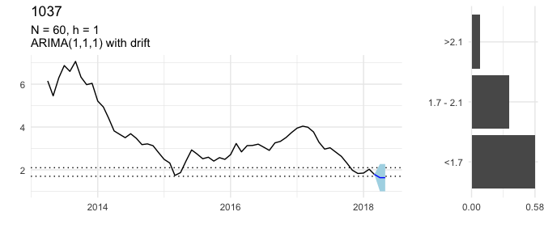

Request 911
-----------

How many material conflict events involving Occupied Palestinian Territory will ICEWS record in March 2018?

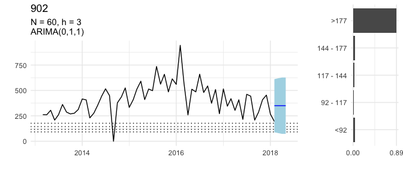

Request 902
-----------

How many material conflict events involving India will ICEWS record in April 2018?

Request 884
-----------

How many positive influenza virus detections will FluNet record for China between 12 March 2018 and 18 March 2018 (epidemiological week 11)?

Request 866
-----------

How many earthquakes of magnitude 5 or stronger will occur worldwide in March 2018?

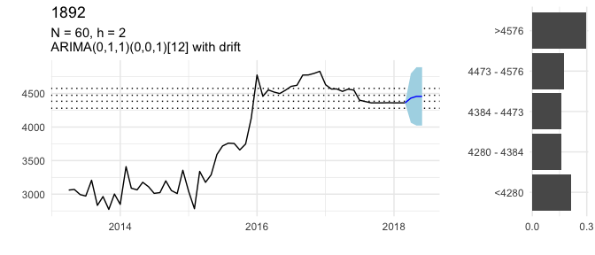

Request 839
-----------

Will ACLED record any riot/protest events in Gabon in April 2018?

Request 830
-----------

How many battle deaths will ACLED record in Yemen in May 2018?

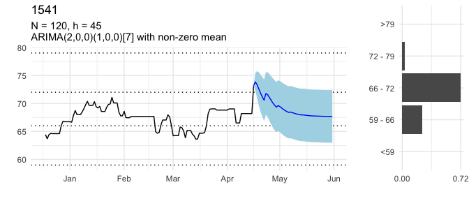

Request 821
-----------

How many battle deaths will ACLED record in Afghanistan in April 2018?

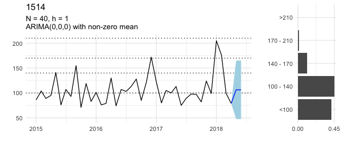
