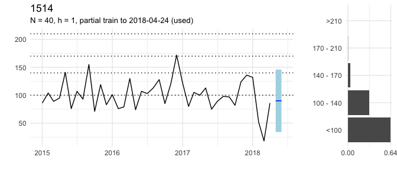
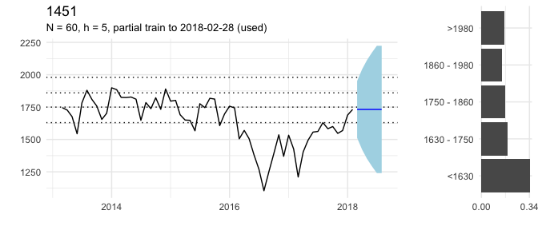
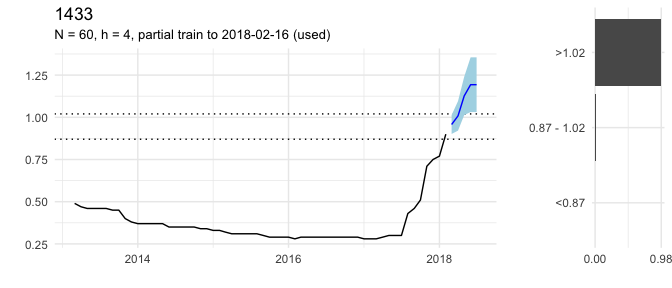
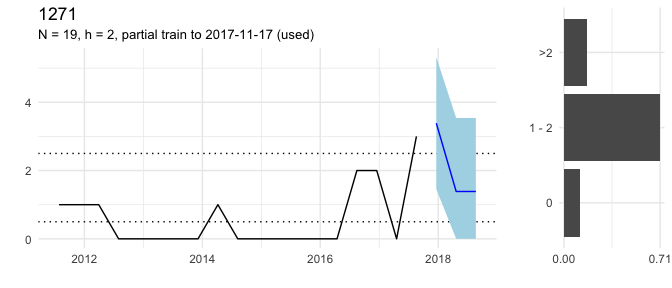
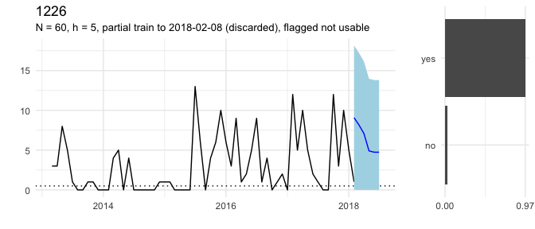
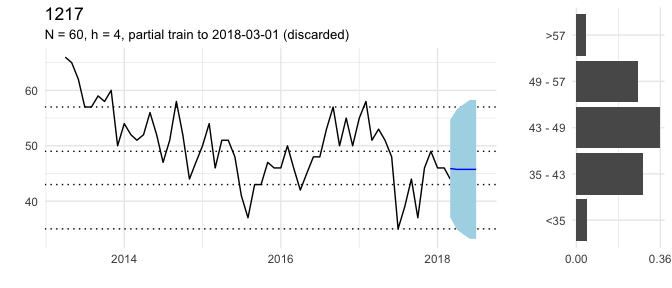
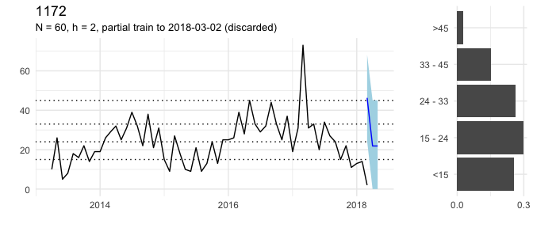
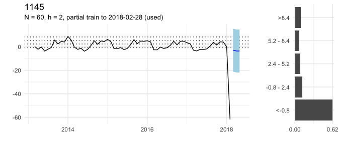
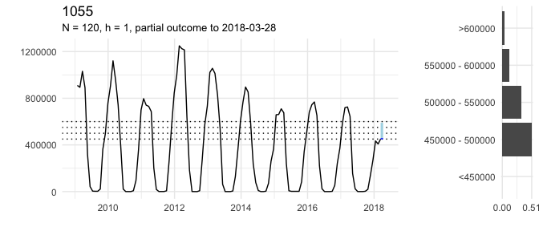

RCT test output
================
Andreas Beger, Predictive Heuristics
2018-04-20

-   [Are the base models estimating and without obvious mistakes?](#are-the-base-models-estimating-and-without-obvious-mistakes)
-   [Plot ARIMA forecasts](#plot-arima-forecasts)

Are the base models estimating and without obvious mistakes?
============================================================

|   IFP| Estimated |    h|  lambda| time\_period | data\_aggregated | partial\_train | partial\_outcome |
|-----:|:----------|----:|-------:|:-------------|:-----------------|:---------------|:-----------------|
|  1433| TRUE      |    5|      NA| month        | FALSE            | discarded      | FALSE            |
|  1406| TRUE      |    3|      NA| month        | FALSE            | used           | FALSE            |
|  1271| FALSE     |   NA|      NA| NA           | NA               | NA             | NA               |
|  1235| TRUE      |    2|      NA| month        | FALSE            | used           | FALSE            |
|  1226| TRUE      |    5|      NA| month        | FALSE            | discarded      | FALSE            |
|  1208| TRUE      |    1|      NA| fixed        | TRUE             | no             | TRUE             |
|  1190| TRUE      |    5|       0| month        | FALSE            | discarded      | FALSE            |
|  1145| TRUE      |    2|      NA| month        | FALSE            | used           | FALSE            |
|  1055| TRUE      |    1|      NA| fixed        | TRUE             | no             | TRUE             |
|  1037| TRUE      |    3|      NA| month        | FALSE            | used           | FALSE            |
|  1028| TRUE      |   21|      NA| day          | FALSE            | no             | FALSE            |
|   938| FALSE     |   NA|      NA| NA           | NA               | NA             | NA               |
|   929| TRUE      |    4|      NA| month        | FALSE            | used           | FALSE            |
|   866| TRUE      |    1|      NA| month        | FALSE            | no             | TRUE             |
|   839| TRUE      |    3|       0| month        | FALSE            | discarded      | FALSE            |
|   821| TRUE      |    2|      NA| month        | FALSE            | used           | FALSE            |

| IFP  | Error                                                                                          |
|:-----|:-----------------------------------------------------------------------------------------------|
| 938  | validate\_data(target, data\_period, question\_period): Historical data in request appear to n |
| 1271 | validate\_data(target, data\_period, question\_period): Historical data in request appear to n |

Plot ARIMA forecasts
====================

Request 1433
------------

What will be the short-term interest rate for the Czech Republic (CZE) in June 2018?

Request 1406
------------

What will be the monthly period-over-period change in the consumer price index (CPI) for Egypt in May 2018?

Request 1271
------------

How many United Nations Security Council Resolutions concerning Syria will be vetoed by Russia between 22 April 2018 and 22 August 2018?

Request 1235
------------

What will be the monthly period-over-period change in the consumer price index (CPI) for Benin in April 2018?

Request 1226
------------

Will ACLED record any civilian fatalities in Ghana in June 2018?

Request 1208
------------

What will be the maximum sea ice extent on the Baffin Bay Gulf of St. Lawrence between 21 March 2018 and 10 April 2018?

Request 1190
------------

How many deaths perpetrated by Boko Haram will the Council on Foreign Relations report for July 2018?

Request 1145
------------

What will be the monthly Period-over-Period change in the consumer price index (CPI) for Malawi in April (Month 04) 2018?

Request 1055
------------

What will be the maximum sea ice extent on the Bering Sea between 14 March 2018 and 10 April 2018?

Request 1037
------------

What will be the long-term interest rate for Portugal (PRT) in April 2018?

Request 1028
------------

What will be the daily closing price of gold on 26 April 2018 in USD?

Request 938
-----------

What will be the maximum sea ice extent on the Barents Sea between 1 January 2018 and 10 April 2018?

Request 929
-----------

How much crude oil will Libya produce in May 2018?

Request 866
-----------

How many earthquakes of magnitude 5 or stronger will occur worldwide in March 2018?

Request 839
-----------

Will ACLED record any riot/protest events in Gabon in April 2018?

Request 821
-----------

How many battle deaths will ACLED record in Afghanistan in April 2018?

