Model catalogue
================

List of available models
========================

-   Auto ARIMA; automatic model select of up to a seasonal ARIMA model using AICc (small-sample size corrected AIC).
-   Exponential smoothing state space model (ETS)
-   Arithmetic random walk (RW); implemented as ARIMA(0, 1, 0) with no BoxCox transform
-   Geometric random walk (geometric RW); implemented as ARIMA(0, 1, 0) on log scale
-   Contant mean (Mean); equivalent to ARIMA(0, 0, 0)

Plots for open IFPs
===================

Request 1622
------------

Will ACLED record any civilian fatalities in Sri Lanka in July 2018?

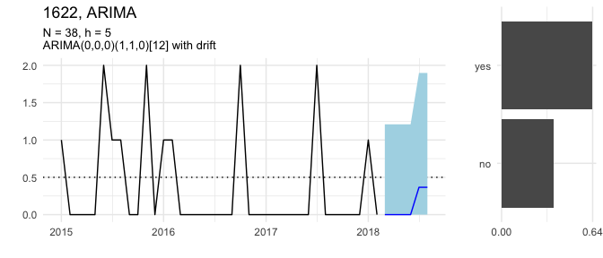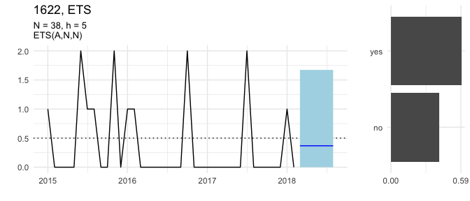

Request 1541
------------

What will be the daily closing spot price of Brent crude oil (USD per barrel) on 31 May 2018, according to the U.S. EIA?

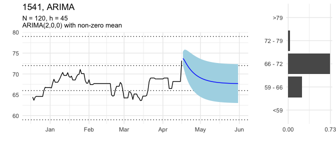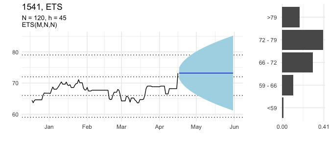

Request 1514
------------

How many earthquakes of magnitude 5 or stronger will occur worldwide in May 2018?

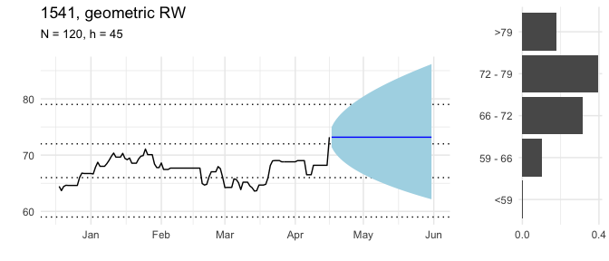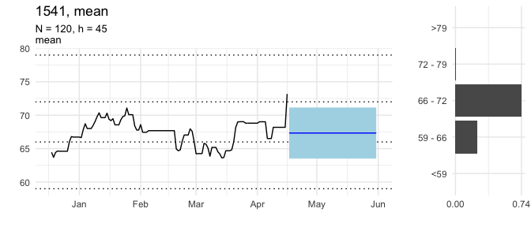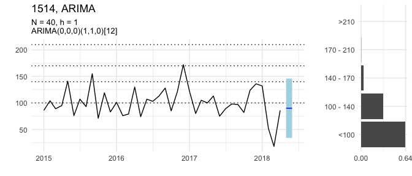

Request 1451
------------

How much crude oil will Nigeria produce in July 2018?

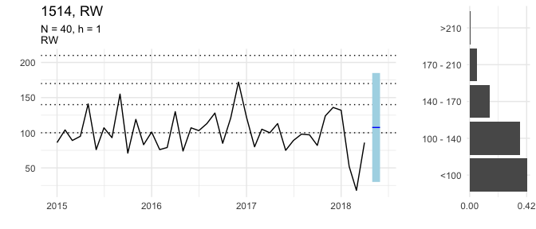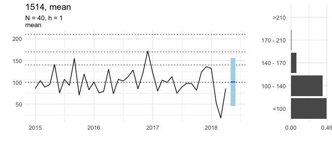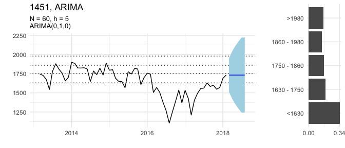

Request 1433
------------

What will be the short-term interest rate for the Czech Republic (CZE) in June 2018?

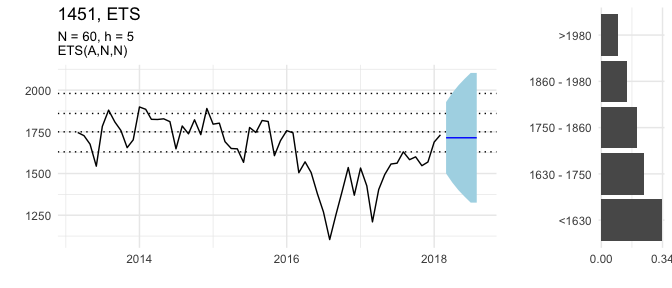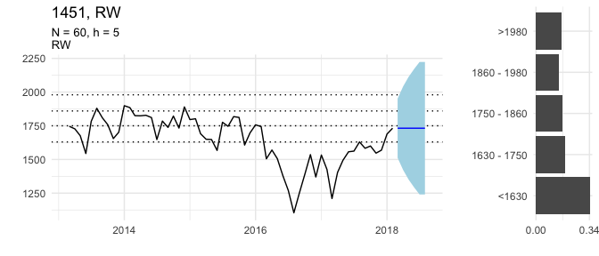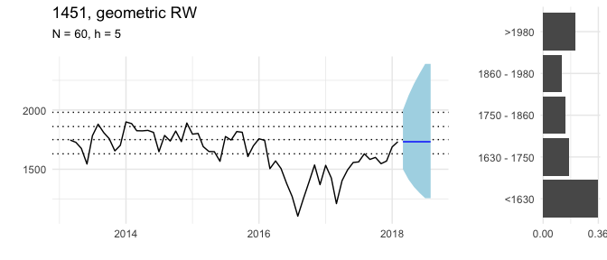

Request 1406
------------

What will be the monthly period-over-period change in the consumer price index (CPI) for Egypt in May 2018?

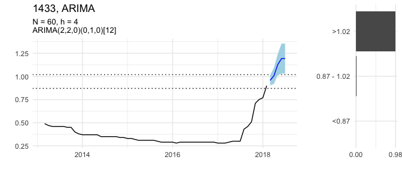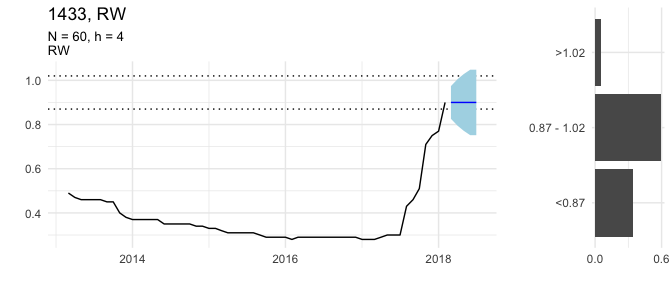

Request 1271
------------

How many United Nations Security Council Resolutions concerning Syria will be vetoed by Russia between 22 April 2018 and 22 August 2018?

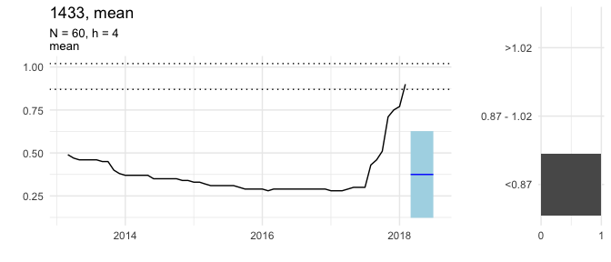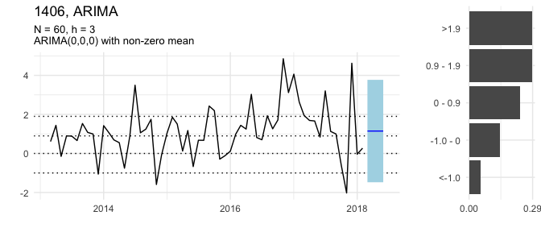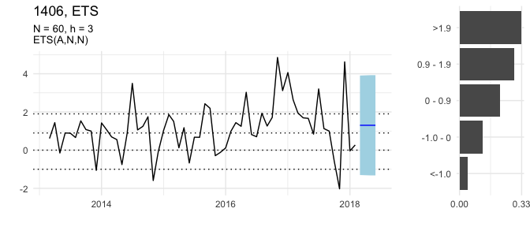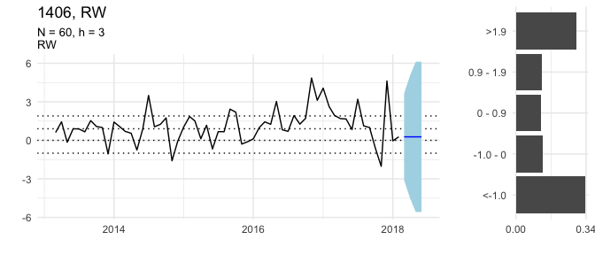

Request 1226
------------

Will ACLED record any civilian fatalities in Ghana in June 2018?

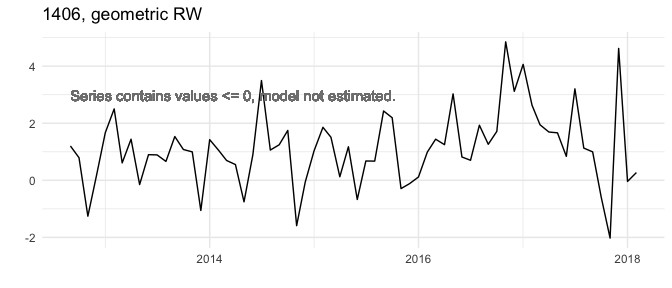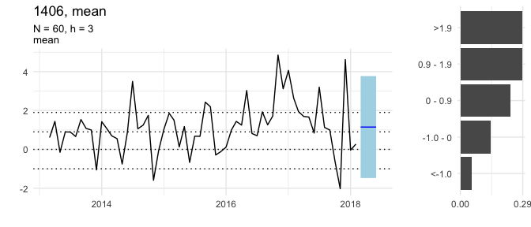

Request 1217
------------

What will be the approval rate for Japan's cabinet in NHK's monthly survey in June 2018?

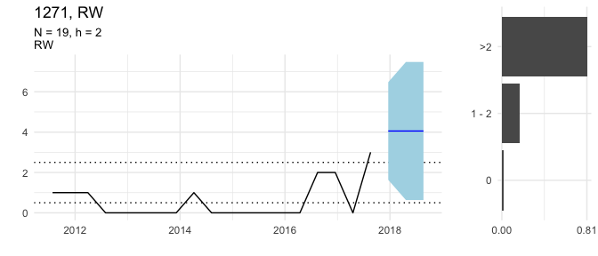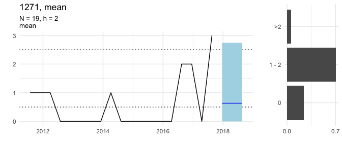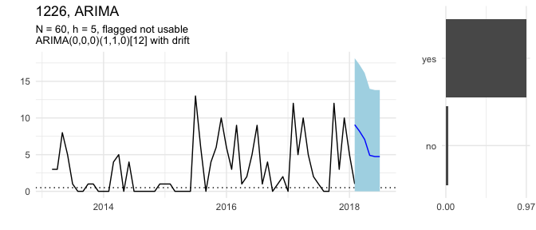

Request 1190
------------

How many deaths perpetrated by Boko Haram will the Council on Foreign Relations report for July 2018?

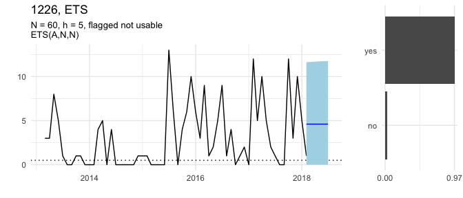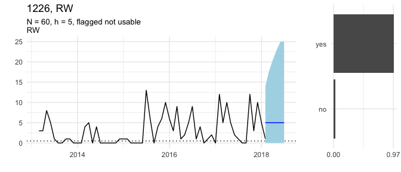

Request 1136
------------

Will ACLED record any riot/protest events in Gambia in July 2018?

Request 1019
------------

What will be the FAO Dairy Price Index in May 2018?

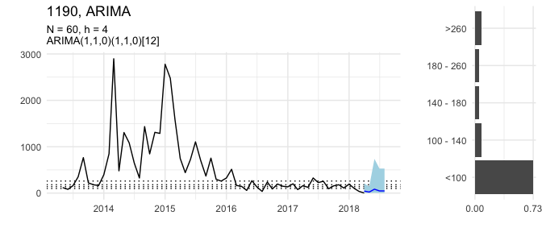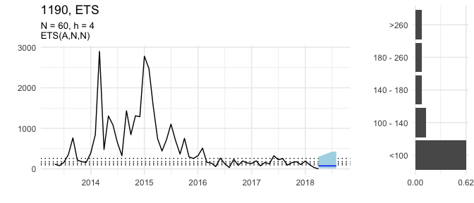

Request 929
-----------

How much crude oil will Libya produce in May 2018?

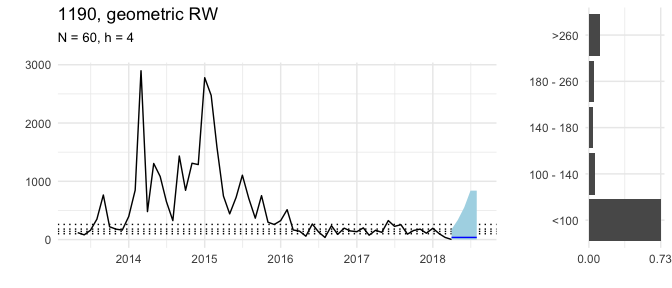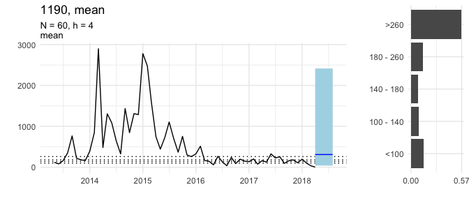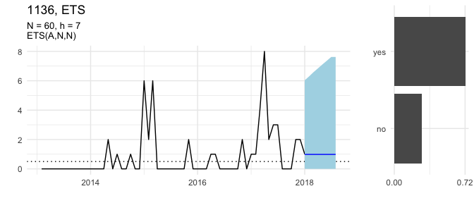

Request 893
-----------

What will be the South Korean Won to one U.S. Dollar daily exchange rate on 29 June 2018?

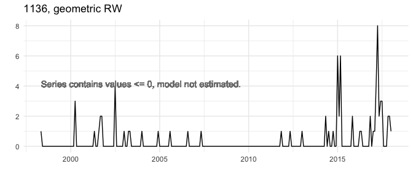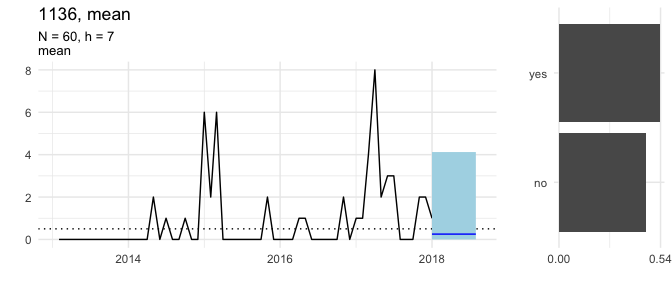

Request 875
-----------

What will be the FAO Sugar Price Index in June 2018?

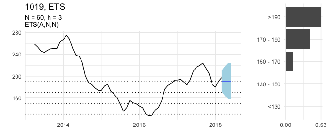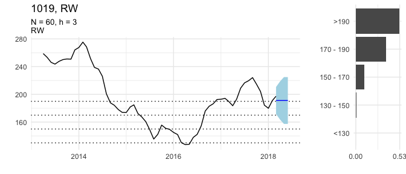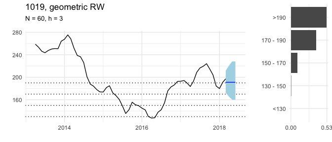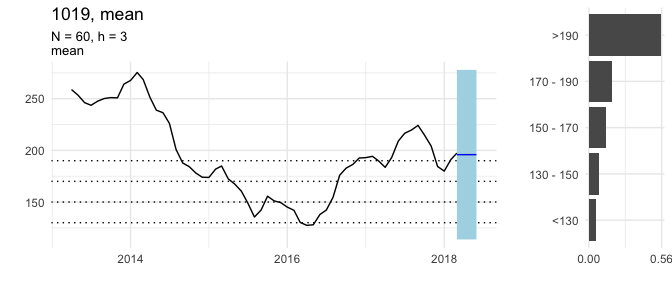

Request 830
-----------

How many battle deaths will ACLED record in Yemen in May 2018?

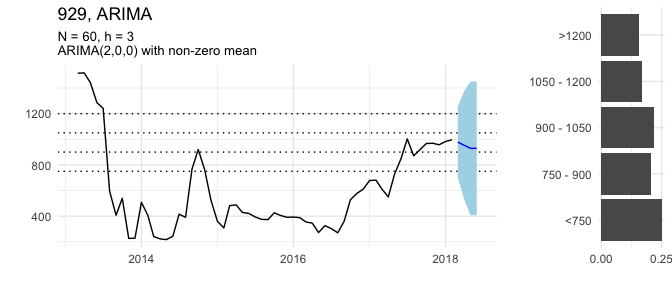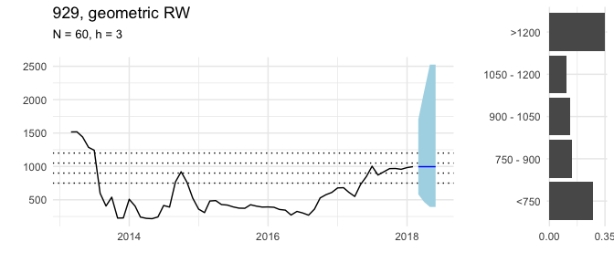

Plots for closed IFPs
=====================

Request 1235
------------

What will be the monthly period-over-period change in the consumer price index (CPI) for Benin in April 2018?

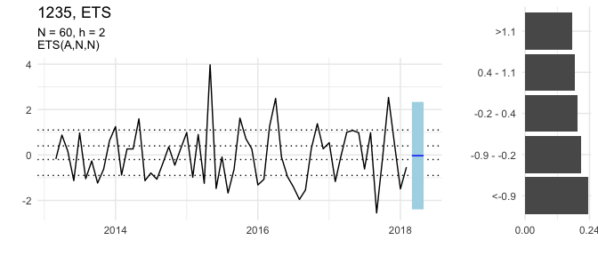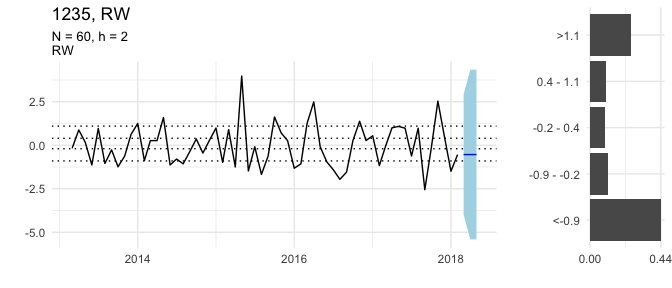

Request 1208
------------

What will be the maximum sea ice extent on the Baffin Bay Gulf of St. Lawrence between 21 March 2018 and 10 April 2018?

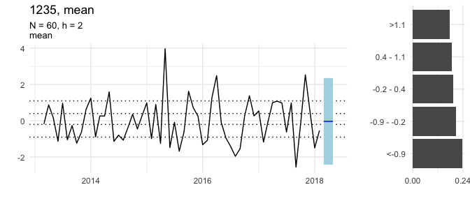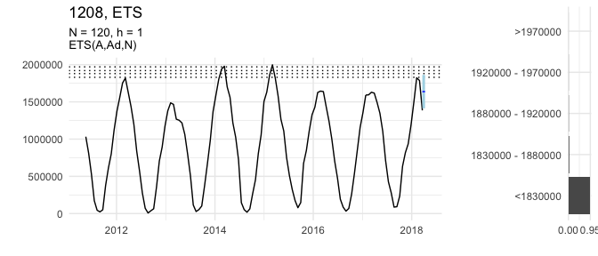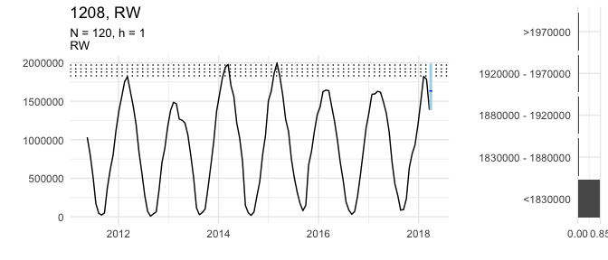

Request 1172
------------

How many 'hacking or malware (HACK)' data breaches will Privacy Rights Clearinghouse record in April 2018?

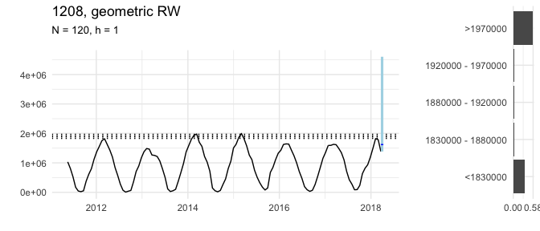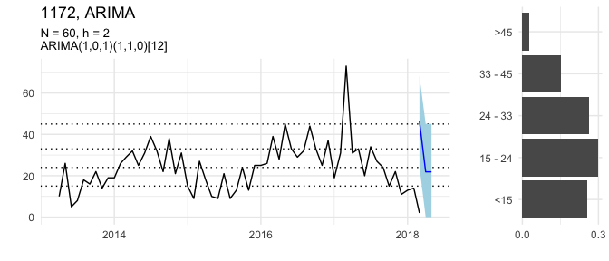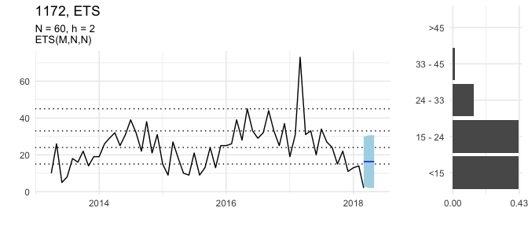

Request 1145
------------

What will be the monthly Period-over-Period change in the consumer price index (CPI) for Malawi in April (Month 04) 2018?

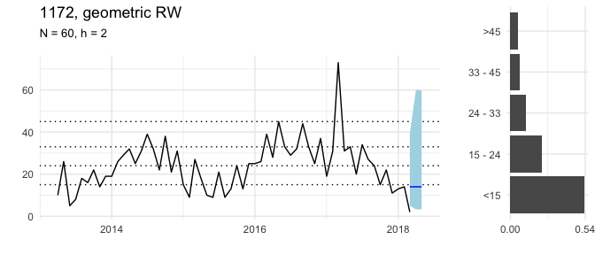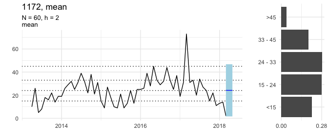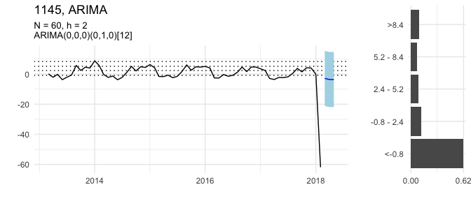

Request 1055
------------

What will be the maximum sea ice extent on the Bering Sea between 14 March 2018 and 10 April 2018?

Request 1037
------------

What will be the long-term interest rate for Portugal (PRT) in April 2018?

Request 1028
------------

What will be the daily closing price of gold on 26 April 2018 in USD?

Request 938
-----------

What will be the maximum sea ice extent on the Barents Sea between 1 January 2018 and 10 April 2018?

Request 911
-----------

How many material conflict events involving Occupied Palestinian Territory will ICEWS record in March 2018?

Request 902
-----------

How many material conflict events involving India will ICEWS record in April 2018?

Request 884
-----------

How many positive influenza virus detections will FluNet record for China between 12 March 2018 and 18 March 2018 (epidemiological week 11)?

Request 866
-----------

How many earthquakes of magnitude 5 or stronger will occur worldwide in March 2018?

Request 839
-----------

Will ACLED record any riot/protest events in Gabon in April 2018?

Request 821
-----------

How many battle deaths will ACLED record in Afghanistan in April 2018?

