RCT test output
================
Andreas Beger, Predictive Heuristics
2018-04-19

-   [Are the base models estimating and without obvious mistakes?](#are-the-base-models-estimating-and-without-obvious-mistakes)
-   [Plot ARIMA forecasts](#plot-arima-forecasts)
-   [Summary table for all models and all IFPs](#summary-table-for-all-models-and-all-ifps)
-   [Plot forecasts for all models and all IFPs](#plot-forecasts-for-all-models-and-all-ifps)

Are the base models estimating and without obvious mistakes?
============================================================

|   IFP| Model | Estimated |    h|  lambda| time\_period | data\_aggregated | partial\_train | partial\_outcome |
|-----:|:------|:----------|----:|-------:|:-------------|:-----------------|:---------------|:-----------------|
|  1433| ARIMA | TRUE      |    5|      NA| month        | FALSE            | discarded      | FALSE            |
|  1406| ARIMA | TRUE      |    3|      NA| month        | FALSE            | used           | FALSE            |
|  1271| ARIMA | FALSE     |   NA|      NA| NA           | NA               | NA             | NA               |
|  1235| ARIMA | TRUE      |    2|      NA| month        | FALSE            | used           | FALSE            |
|  1226| ARIMA | TRUE      |    5|      NA| month        | FALSE            | discarded      | FALSE            |
|  1208| ARIMA | TRUE      |    1|      NA| fixed        | TRUE             | no             | TRUE             |
|  1190| ARIMA | TRUE      |    5|       0| month        | FALSE            | discarded      | FALSE            |
|  1145| ARIMA | TRUE      |    2|      NA| month        | FALSE            | used           | FALSE            |
|  1055| ARIMA | TRUE      |    1|      NA| fixed        | TRUE             | no             | TRUE             |
|  1037| ARIMA | TRUE      |    3|      NA| month        | FALSE            | used           | FALSE            |
|  1028| ARIMA | TRUE      |   21|      NA| day          | FALSE            | no             | FALSE            |
|   938| ARIMA | FALSE     |   NA|      NA| NA           | NA               | NA             | NA               |
|   929| ARIMA | TRUE      |    4|      NA| month        | FALSE            | used           | FALSE            |
|   866| ARIMA | TRUE      |    1|      NA| month        | FALSE            | no             | TRUE             |
|   839| ARIMA | TRUE      |    3|       0| month        | FALSE            | discarded      | FALSE            |
|   821| ARIMA | TRUE      |    2|      NA| month        | FALSE            | used           | FALSE            |

| IFP  | Error                                                                                          |
|:-----|:-----------------------------------------------------------------------------------------------|
| 938  | validate\_data(target, data\_period, question\_period): Historical data in request appear to n |
| 1271 | validate\_data(target, data\_period, question\_period): Historical data in request appear to n |

Plot ARIMA forecasts
====================

Request 1433
------------

What will be the short-term interest rate for the Czech Republic (CZE) in June 2018?

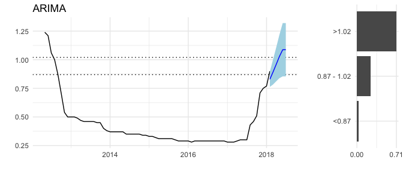

Request 1406
------------

What will be the monthly period-over-period change in the consumer price index (CPI) for Egypt in May 2018?

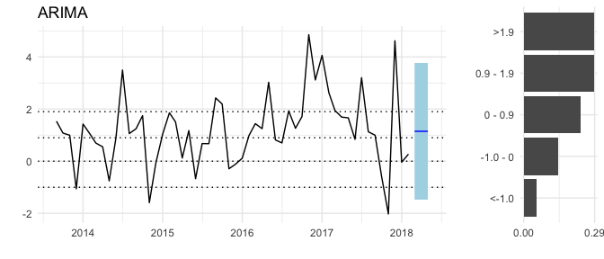

Request 1271
------------

How many United Nations Security Council Resolutions concerning Syria will be vetoed by Russia between 22 April 2018 and 22 August 2018?

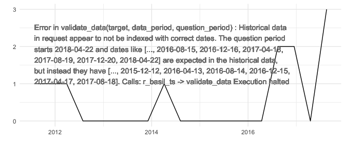

Request 1235
------------

What will be the monthly period-over-period change in the consumer price index (CPI) for Benin in April 2018?

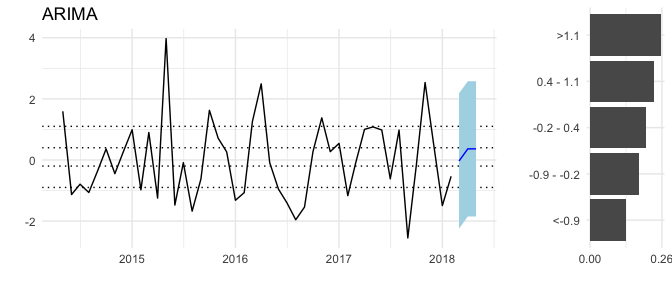

Request 1226
------------

Will ACLED record any civilian fatalities in Ghana in June 2018?

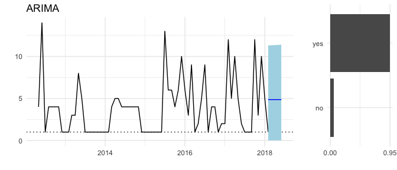

Request 1208
------------

What will be the maximum sea ice extent on the Baffin Bay Gulf of St. Lawrence between 21 March 2018 and 10 April 2018?

Request 1190
------------

How many deaths perpetrated by Boko Haram will the Council on Foreign Relations report for July 2018?

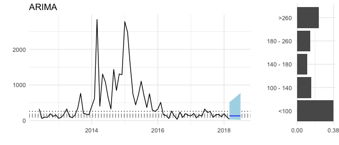

Request 1145
------------

What will be the monthly Period-over-Period change in the consumer price index (CPI) for Malawi in April (Month 04) 2018?

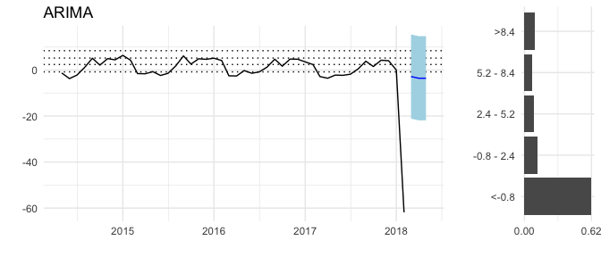

Request 1055
------------

What will be the maximum sea ice extent on the Bering Sea between 14 March 2018 and 10 April 2018?

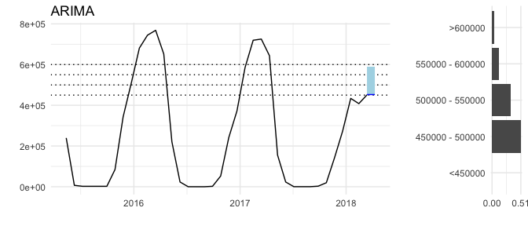

Request 1037
------------

What will be the long-term interest rate for Portugal (PRT) in April 2018?

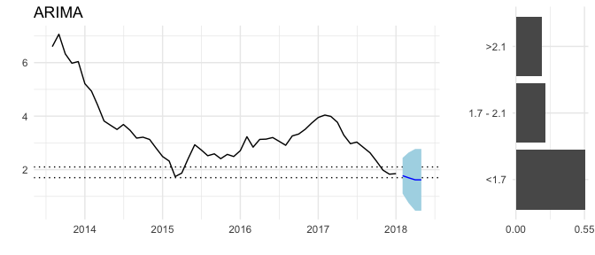

Request 1028
------------

What will be the daily closing price of gold on 26 April 2018 in USD?

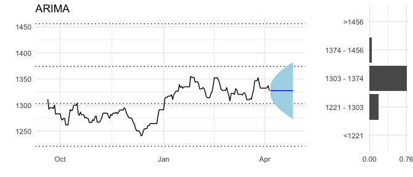

Request 938
-----------

What will be the maximum sea ice extent on the Barents Sea between 1 January 2018 and 10 April 2018?

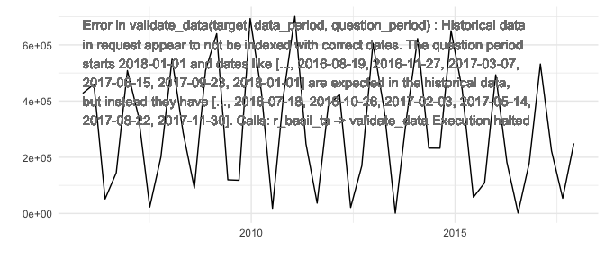

Request 929
-----------

How much crude oil will Libya produce in May 2018?

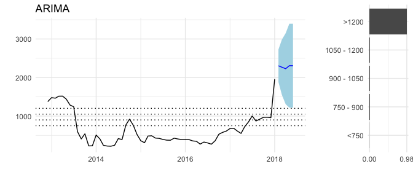

Request 866
-----------

How many earthquakes of magnitude 5 or stronger will occur worldwide in March 2018?

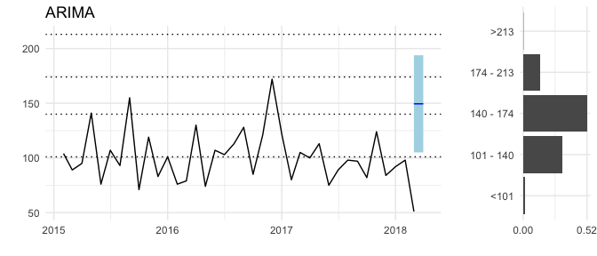

Request 839
-----------

Will ACLED record any riot/protest events in Gabon in April 2018?

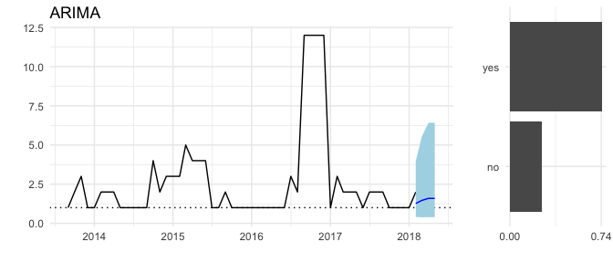

Request 821
-----------

How many battle deaths will ACLED record in Afghanistan in April 2018?

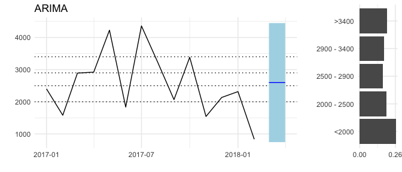

Summary table for all models and all IFPs
=========================================

| IFP  | Model         |  Estimated|       RMSE|
|:-----|:--------------|----------:|----------:|
| 1028 | ARIMA         |          1|       6.06|
| 1028 | ETS           |          1|       6.05|
| 1028 | RWF           |          1|         NA|
| 1028 | geometric RWF |          1|         NA|
| 1037 | ARIMA         |          1|       0.33|
| 1037 | ETS           |          1|       0.34|
| 1037 | RWF           |          1|         NA|
| 1037 | geometric RWF |          1|         NA|
| 1055 | ARIMA         |          1|  101611.05|
| 1055 | ETS           |          1|         NA|
| 1055 | RWF           |          1|         NA|
| 1055 | geometric RWF |          1|         NA|
| 1145 | ARIMA         |          1|       8.35|
| 1145 | ETS           |          1|       8.46|
| 1145 | RWF           |          1|         NA|
| 1145 | geometric RWF |          0|         NA|
| 1190 | ARIMA         |          1|     499.02|
| 1190 | ETS           |          1|     499.65|
| 1190 | RWF           |          1|         NA|
| 1190 | geometric RWF |          1|         NA|
| 1208 | ARIMA         |          1|  123009.63|
| 1208 | ETS           |          1|  145671.63|
| 1208 | RWF           |          1|         NA|
| 1208 | geometric RWF |          1|         NA|
| 1226 | ARIMA         |          1|       3.23|
| 1226 | ETS           |          1|       3.09|
| 1226 | RWF           |          1|         NA|
| 1226 | geometric RWF |          1|         NA|
| 1235 | ARIMA         |          1|       1.12|
| 1235 | ETS           |          1|       1.21|
| 1235 | RWF           |          1|         NA|
| 1235 | geometric RWF |          0|         NA|
| 1271 | All models    |          0|         NA|
| 1406 | ARIMA         |          1|       1.33|
| 1406 | ETS           |          1|       1.33|
| 1406 | RWF           |          1|         NA|
| 1406 | geometric RWF |          0|         NA|
| 1433 | ARIMA         |          1|       0.03|
| 1433 | ETS           |          1|       0.03|
| 1433 | RWF           |          1|         NA|
| 1433 | geometric RWF |          1|         NA|
| 821  | ARIMA         |          1|     909.67|
| 821  | ETS           |          1|     909.72|
| 821  | RWF           |          1|         NA|
| 821  | geometric RWF |          1|         NA|
| 839  | ARIMA         |          1|       2.21|
| 839  | ETS           |          1|       2.22|
| 839  | RWF           |          1|         NA|
| 839  | geometric RWF |          1|         NA|
| 866  | ARIMA         |          1|      22.73|
| 866  | ETS           |          1|      22.73|
| 866  | RWF           |          1|         NA|
| 866  | geometric RWF |          1|         NA|
| 929  | ARIMA         |          1|     186.59|
| 929  | ETS           |          1|     193.00|
| 929  | RWF           |          1|         NA|
| 929  | geometric RWF |          1|         NA|
| 938  | All models    |          0|         NA|

Plot forecasts for all models and all IFPs
==========================================
